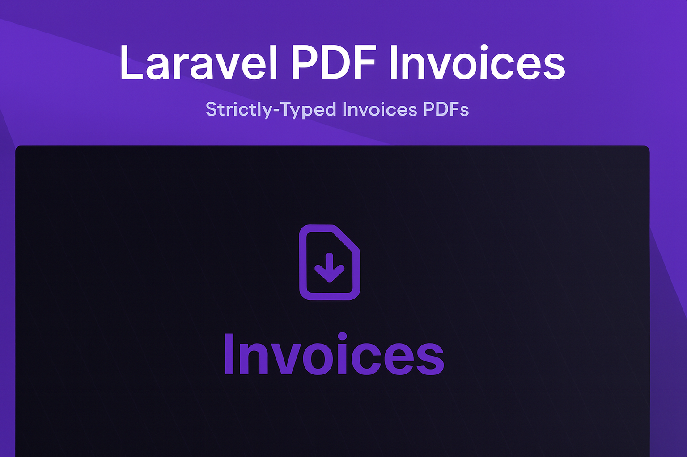

<p align="center">
  <a href="https://packagist.org/packages/akira/laravel-pdf-invoices"></a>
  <a href="https://github.com/akira-io/laravel-pdf-invoices/actions?query=workflow%3Arun-tests+branch%3Amain"></a>
  <a href="https://github.com/akira-io/laravel-pdf-invoices/actions?query=workflow%3A%22Fix+PHP+code+style+issues%22+branch%3Amain"></a>
  <a href="https://packagist.org/packages/akira/laravel-pdf-invoices"></a>
</p>

Beautiful, type-safe PDF invoice generator for Laravel 12+ with a fluent builder API, multiple professional templates,
and multi-language support.

## Features

- **Builder Pattern** - Chainable, fluent API for creating invoices
- **Type-Safe** - Strict types, readonly DTOs, zero magic
- **Carbon Support** - Seamless `Carbon` and `CarbonImmutable` integration for Laravel 11+
- **3 Templates** - Minimal, modern, and branded designs (Tailwind CSS)
- **Multi-Language** - English, Portuguese (easily extensible)
- **Custom Fields** - Add any custom attributes to entities
- **Currency Support** - Flexible formatting with Laravel integration
- **PDF Generation** - Powered by Spatie's laravel-pdf with `puppeteer` integration
- **Fully Tested** - Comprehensive PestPHP test suite
- **Quality Tools** - PHPStan level max, Laravel Pint, Rector

## Installation

Install via Composer:

```bash
composer require akira/laravel-pdf-invoices
```

Install peer dependency (Puppeteer for PDF generation):

```bash
npm install puppeteer
```

Publish assets:

```bash
php artisan vendor:publish --provider="Akira\PdfInvoices\PdfInvoicesServiceProvider"
```

## Quick Start

```php
use Akira\PdfInvoices\Builders\InvoiceBuilder;
use Akira\PdfInvoices\Builders\EntityBuilder;
use Akira\PdfInvoices\Builders\ItemBuilder;

$invoice = InvoiceBuilder::make()
    ->seller(
        EntityBuilder::make()
            ->name('Your Company')
            ->address('123 Main St, City')
            ->email('hello@company.com')
            ->vat('123456789')
            ->build()
    )
    ->buyer(
        EntityBuilder::make()
            ->name('Client Name')
            ->email('client@example.com')
            ->address('456 Oak Ave, Town')
            ->vat('987654321')
            ->build()
    )
    ->addItem(
        ItemBuilder::make()
            ->description('Professional Services')
            ->unitPrice(150)
            ->quantity(10)
            ->tax(0.19)
            ->build()
    )
    ->addItem(
        ItemBuilder::make()
            ->description('Support & Maintenance')
            ->unitPrice(100)
            ->quantity(5)
            ->tax(0.19)
            ->discount(0.10)
            ->build()
    )
    ->notes('Payment due within 30 days.')
    ->build();

// Generate and save PDF
$pdf = $invoice->generatePdf();
$pdf->save('invoices/invoice-001.pdf');

// Or get as stream (for downloads/email)
return response()->streamDownload(
    fn() => echo $pdf,
    'invoice-001.pdf'
);
```

## Templates

Choose your preferred invoice style:

### Minimal

Clean and simple, perfect for service invoices.

### Modern

Contemporary design with gradient header and professional layout.

### Branded

Business-focused with color accents for custom branding.

```php
// Use a specific template
$pdf = $invoice->generatePdf(template: 'branded');
```

## Localization

Generate invoices in different languages:

```php
// Portuguese
$pdf = $invoice->generatePdf(locale: 'pt');

// English (default)
$pdf = $invoice->generatePdf(locale: 'en');
```

Supported: English (`en`), Portuguese (`pt`)

[View all translation keys →](docs/localization.md)

## Custom Attributes

Add custom fields to any entity:

```php
$seller = EntityBuilder::make()
    ->name('Company')
    ->withAttributes([
        'bank_account' => 'IBAN123456',
        'registration' => 'REG-123',
    ])
    ->build();

// Access them
$seller->attributes('bank_account'); // IBAN123456
```

## Currency Formatting

Use Laravel's currency or custom formatters:

```php
// Laravel currency (respects app.php locale)
$invoice->currency = 'EUR';

// Custom currency symbol
$invoice->currency = '$';
```

## Storage

Save invoices to disk or custom storage:

```php
// Save to storage/app/invoices
$storage = app(\Akira\PdfInvoices\Contracts\StorageDriverContract::class);
$storage->save('invoice-001.pdf', $pdf);

// Or use Laravel Storage facade directly
\Illuminate\Support\Facades\Storage::put('invoices/invoice-001.pdf', $pdf);
```

## Advanced Usage

### Discounts & Taxes

```php
ItemBuilder::make()
    ->description('Service')
    ->unitPrice(1000)
    ->quantity(2)
    ->tax(0.19)           // 19% tax
    ->discount(0.10)      // 10% discount on subtotal
    ->build()
```

### Custom Invoice Numbers & Dates

```php
$invoice = InvoiceBuilder::make()
    ->invoiceNumber('INV-2024-001')
    ->issuedAt(now())
    ->dueAt(now()->addDays(30))
    // ...
    ->build();
```

### Carbon & CarbonImmutable Support

The date methods accept both `Carbon` (mutable) and `CarbonImmutable` (immutable) instances, as well as any `DateTimeInterface` implementation. This makes it seamless to work with Laravel 11+ which uses `CarbonImmutable` by default:

```php
// All of these work seamlessly:
$invoice->issuedAt(Carbon::now());              // Mutable Carbon
$invoice->issuedAt(now());                      // CarbonImmutable (Laravel default)
$invoice->issuedAt(new DateTime('2024-01-01')); // DateTime
$invoice->issuedAt($model->created_at);         // Eloquent model attribute (CarbonImmutable)
```

### Accessing Calculations

```php
$invoice->getSubtotal();      // Sum of all items
$invoice->getTotalTax();      // Total tax amount
$invoice->getTotalDiscount(); // Total discount amount
$invoice->getTotal();         // Final amount due
```

## Testing

Run the test suite:

```bash
composer test
```

With coverage:

```bash
composer test -- --coverage
```

## Documentation

- [Full Documentation](docs/index.md)
- [Builder Pattern](docs/builders.md)
- [Custom Attributes](docs/attributes.md)
- [Templates Guide](docs/templates.md)
- [Localization](docs/localization.md)
- [CSS Compilation](docs/css-compilation.md)

## Changelog

See [CHANGELOG.md](CHANGELOG.md) for recent changes and updates.

## License

The MIT License (MIT). See [LICENSE.md](LICENSE.md) for details.

## Credits

Built with Laravel best practices and inspired by the Laravel community.

- [Kidiatoliny](https://github.com/kidiatoliny) - Creator
- [All Contributors](https://github.com/akira-io/laravel-pdf-invoices/graphs/contributors)

## Support

Having issues? Check out the [documentation](docs/) or open
an [issue on GitHub](https://github.com/akira-io/laravel-pdf-invoices/issues).